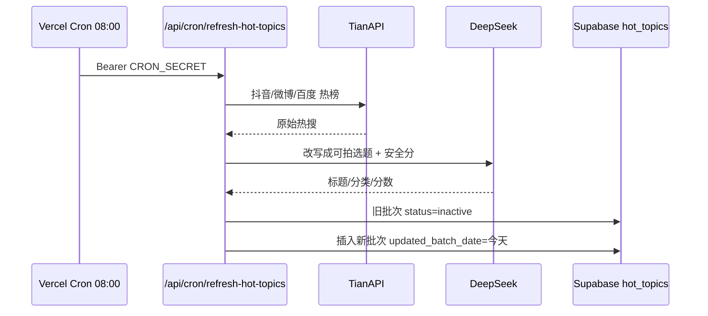

# 每日 8 点热点更新 · 实现说明

## 用户看到什么

- 顶部条：**今日 N 条可拍选题**（来自 `/api/hot-topics/meta`）
- **灵感 TOP3**：当日热点库爆款前 3（`/api/hot-topics/top`）
- **今日热点 Tab**：当日批次全部选题（约 24 条）

## 每天如何换一批新内容



1. **定时**：`vercel.json` → `0 0 * * *`（UTC 0:00 = **北京时间 8:00**）
2. **拉取**：TianAPI（失败则 DailyHotApi）
3. **过滤**：关键词黑名单 + AI 青年向改写
4. **入库**：`replaceHotTopicsBatch` 将昨日 `active` 设为 `inactive`，写入今日新 `active`
5. **展示**：`listActiveHotTopics` 只查 **最新 `updated_batch_date`** 的 active 记录

## 封面图（为何之前没图）

- 外网 Unsplash 在国内常失败 → 已改为 **`/images/covers/*.jpg` 打包进项目**
- 入库时 `cover_image` 写入分类实景路径
- 首页卡片优先读打包 JPG，不再显示 SVG 占位

## 手动刷新（本地 / 运维）

```bash
BASE_URL=http://localhost:3000 npm run seed:hot-topics:force
```

## 环境变量（生产必配）

| 变量 | 作用 |
|------|------|
| `CRON_SECRET` | 定时任务鉴权 |
| `TIANAPI_KEY` | 热榜源 |
| `DEEPSEEK_API_KEY` | AI 改写 |
| `SUPABASE_*` | 入库 |
| `NEXT_PUBLIC_BACKEND_MODE=server` | 启用服务端热点 |

## 下载 / 更新打包封面

```bash
npm run download:covers
```

将实景图保存到 `public/images/covers/`，提交 Git 后国内用户必能加载。
