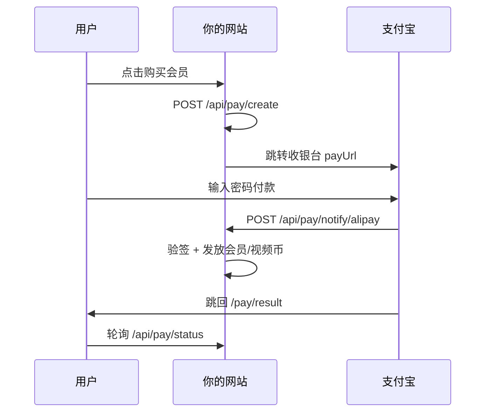

# 支付宝收款 — 接入步骤（H5 手机网站支付）

代码已接好：**创建订单 → 跳转支付宝 → 异步通知发权益 → 回跳结果页**。

---

## 一、你要准备什么

| 材料 | 说明 |
|------|------|
| 营业执照或个体户 | 支付宝开放平台需企业/个体户主体 |
| 支付宝商家账号 | 与开放平台应用绑定 |
| 已备案域名（建议） | 正式环境回调 URL 需公网 HTTPS |

---

## 二、支付宝开放平台（约 3～7 天审核）

### 1. 登录并创建应用

1. 打开 https://open.alipay.com 用企业支付宝登录  
2. **控制台 → 开发者中心 → 网页&移动应用 → 创建应用**  
3. 记下 **APPID**（如 `202100xxxxxxxx`）

### 2. 配置密钥（RSA2）

1. 应用详情 → **开发设置 → 接口加签方式**  
2. 选 **公钥** 模式 → 上传你的 **应用公钥**  
3. 保存后复制 **支付宝公钥**（不是应用公钥）  
4. 本地用工具生成 **应用私钥**（PKCS8），妥善保存，只填服务器环境变量

### 3. 签约产品

在应用里签约：**手机网站支付**（`alipay.trade.wap.pay`）  
审核通过后才能真收款。

### 4. 配置回调地址

在应用 **功能信息** 或网关配置里设置：

| 类型 | 地址 |
|------|------|
| 异步通知（notify） | `https://你的域名/api/pay/notify/alipay` |
| 同步返回（return，可选） | `https://你的域名/pay/result` |

本地开发可用内网穿透（ngrok / cpolar）把 notify 指到本机，或先在 Vercel 测。

---

## 三、Vercel 环境变量（emotion-ai-h5-v2）

**Settings → Environment Variables**：

```env
PAY_PROVIDER=alipay
NEXT_PUBLIC_PAY_PROVIDER=alipay

ALIPAY_APP_ID=202100xxxxxxxx
ALIPAY_PRIVATE_KEY=MIIEvgIBADANBg...（应用私钥，可一行，或用 \n 换行）
ALIPAY_PUBLIC_KEY=MIIBIjANBg...（支付宝公钥，不是应用公钥）
ALIPAY_NOTIFY_URL=https://emotion-ai-h5-v2.vercel.app/api/pay/notify/alipay

# 网站根地址（用于支付完成跳回）
NEXT_PUBLIC_APP_URL=https://emotion-ai-h5-v2.vercel.app
```

可选：

```env
# 沙箱（测试）
ALIPAY_SANDBOX=true
ALIPAY_GATEWAY=https://openapi-sandbox.dl.alipaydev.com/gateway.do

# 用户取消支付时返回的页面
ALIPAY_QUIT_URL=https://emotion-ai-h5-v2.vercel.app/account-package
```

**保留：**

```env
NEXT_PUBLIC_BACKEND_MODE=server
SESSION_SECRET=...
NEXT_PUBLIC_SUPABASE_URL=...
SUPABASE_SERVICE_ROLE_KEY=...
```

保存后 **Redeploy**。

内测仍可用 `PAY_PROVIDER=mock`（点「模拟支付成功」）。

---

## 四、支付流程（上线后）



---

## 五、测试清单

1. `PAY_PROVIDER=alipay` 且 5 个 `ALIPAY_*` 必填项已填  
2. 登录后打开 **会员与视频币** → 购买  
3. 应提示「正在跳转支付宝…」并打开支付宝页  
4. 付 0.01 元沙箱或正式小额 → 回到 **支付结果页** → 显示成功  
5. **我的** 里会员/视频币已增加  
6. Vercel Logs 无 `[pay] alipay notify sign verify failed`

---

## 六、常见错误

| 现象 | 处理 |
|------|------|
| 提示「支付宝未配置完整」 | 缺 `ALIPAY_NOTIFY_URL` 或私钥/公钥 |
| 跳转支付宝报错 invalid-signature | 私钥与开放平台上传的公钥不是一对；或填成了应用公钥 |
| 付了款没到账 | 看 notify 是否 200；notify URL 必须公网 HTTPS |
| 仍弹出 Mock 三按钮 | `PAY_PROVIDER` 仍是 mock，或未 Redeploy |
| 金额不一致 fail | 订单金额被改过，与支付宝回调不一致 |

---

## 七、密钥格式说明

- `ALIPAY_PRIVATE_KEY`：应用私钥，PKCS8，可整行粘贴，也可用 `\n` 表示换行  
- `ALIPAY_PUBLIC_KEY`：开放平台显示的 **支付宝公钥**  
- 切勿把私钥提交到 GitHub

---

完成开放平台配置后，把 **APPID** 是否已过审、**手机网站支付** 是否已签约发我，可帮你核对环境变量。
